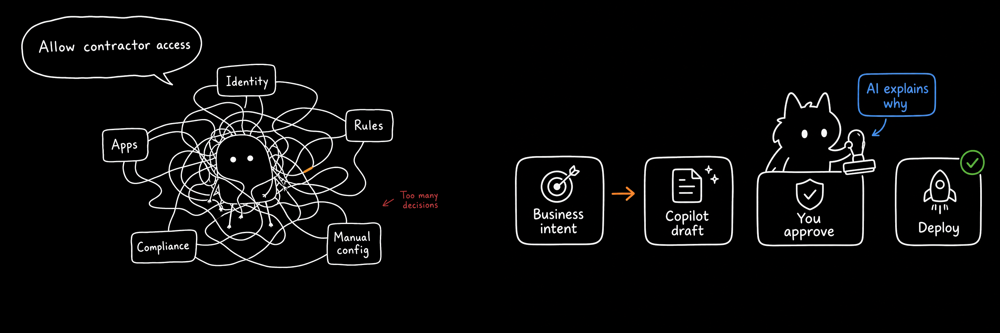
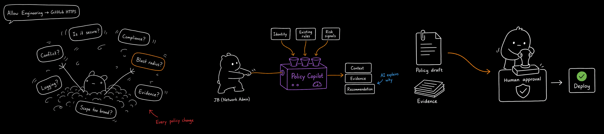
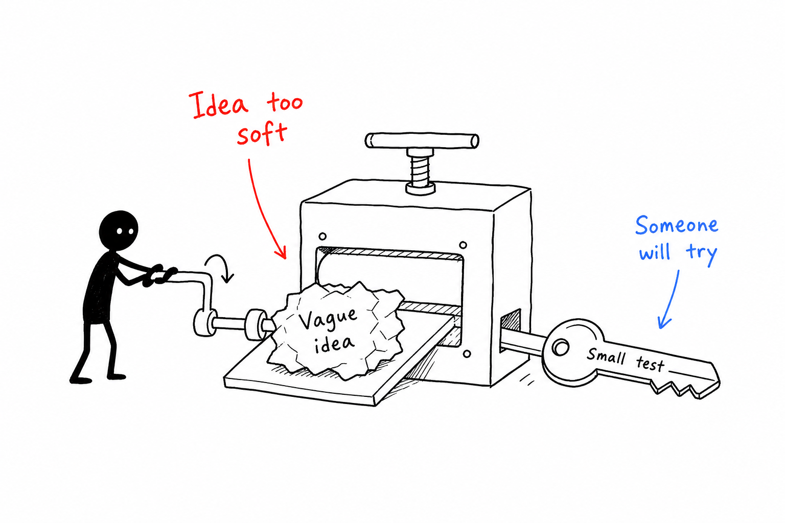
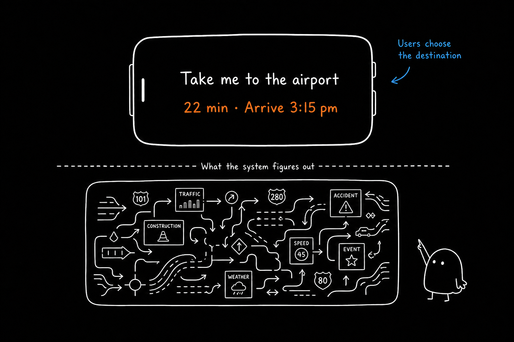

# ai-playground

Portfolio site for case studies, Craft gallery (motion + illustration), and Ideas (AI experiments). Built with Next.js 16, React 19, Tailwind CSS v4, and Framer Motion.

## Preview

Index slide monograms (Craft + Ideas):

<p align="center">
  
  &nbsp;&nbsp;
  
</p>

Case study editorial art ([Cisco Policy Copilot](https://jatinbansal.vercel.app/projects/cisco-policy-copilot) — JB illustration library):

<p align="center">
  
</p>

<p align="center">
  
</p>

Impact-card illustration (light mode):

<p align="center">
  
</p>

## Documentation

| Doc | Contents |
|-----|----------|
| [`IA.md`](./IA.md) | Site tree, index frames, case study visibility, media sources |
| [`design.md`](./design.md) | Slider, Craft/Ideas rules, case study components, JB illustrations |
| `.cursor/skills/jb_illustrations/` | Cursor skill for generating editorial art |
| `.cursor/rules/case-study-headings.mdc` | Title case for headings & captions |

## Getting started

```bash
npm install
npm run dev
```

Open [http://localhost:3000](http://localhost:3000).

### Environment variables

| Variable | Required | Purpose |
|----------|----------|---------|
| `OPENAI_API_KEY` | For live JBAI replies | OpenAI chat completions (`gpt-4o-mini`) |
| `GIPHY_API_KEY` | Optional | Reaction GIFs on assistant replies |
| `AI_CHAT_OPENAI_ENABLED` | Optional | Set to `false` to disable OpenAI (static/fallback only) |
| `AI_CHAT_OPENAI_MAX_PER_USER` | Optional | OpenAI replies per browser session (default in code) |
| `NEXT_PUBLIC_SITE_URL` | Production | Canonical URL for SEO metadata and sitemap (e.g. `https://jatinbansal.vercel.app`) |

## Scripts

| Command | Purpose |
|---------|---------|
| `npm run dev` | Local development server |
| `npm run build` | Production build |
| `npm run start` | Run production build |
| `npm run lint` | ESLint |
| `npm run spellcheck` | cspell over `src/**/*.{ts,tsx,md}` |

## Information architecture

Full route map, index slider frames, and visibility rules: **[`IA.md`](./IA.md)**.

| Route | Content |
|-------|---------|
| `/` | Index — horizontal scroll slider (hero → projects → ideas → My favorite → craft → me → contact → manifest) |
| `/projects` | Case study list with hover thumbnails |
| `/projects/[slug]` | Long-form case study pages |
| `/craft` | Motion graphics and illustration gallery (bento grid + filter chips) |
| `/craft/[slug]` | Craft essays (e.g. design review checklist) |
| `/ideas` | AI experiment demos — external side projects with detail modals |
| `/archive` | About / “Me” slide destination |

Legacy `/fun/*` redirects to `/craft`; `/recent` aliases the Cisco case study (`next.config.ts`, `src/app/recent/page.tsx`).

## Case studies

| Concern | Location |
|---------|----------|
| Metadata (title, year, client, overview) | `src/lib/project-content.ts` |
| Page layouts and body copy | `src/components/case-studies/*` |
| Route gateway | `src/components/projects/dynamic-case-study-gateway.tsx` |
| Projects index (hover thumbnails, hidden slugs) | `src/lib/projects-list-data.ts` |
| CDN media keys | `src/lib/asset-cdn.ts` → `CASE_STUDY_CDN_MEDIA` |
| Editorial components | `src/components/case-studies/case-study-prose.tsx` |

Heading and caption rules: `.cursor/rules/case-study-headings.mdc`. Implementation detail: [`design.md` § Case studies](./design.md#case-studies).

### JB illustrations

Hand-drawn editorial art for impact cards and full-width media bands (English labels, light + dark variants).

| Piece | Location |
|-------|----------|
| Cursor skill | `.cursor/skills/jb_illustrations/` |
| Published PNGs | `public/assets/illustrations/jb_illustrations/*-en.png` |
| ID → path map | `src/lib/jb-illustration-library.ts` → `getJbIllustration()` |

Register new assets in `JB_ILLUSTRATIONS`, then reference them from case study components. Skill workflow and background modes: [`design.md` § JB illustration library](./design.md#jb-illustration-library).

<p align="center">
  
</p>

## Craft gallery

- **Registry** (titles, categories, media, essays): `src/lib/experiments-registry.ts`
- **Filter chips & bento layout**: `src/lib/experiments-filters.ts`
- **Page shell**: `src/app/craft/` + `src/components/experiments/*`

Default filter is **Motion Graphic**. Categories on Craft: `motion-graphic`, `illustration`. Article-only and AI experiment entries are excluded from the Craft grid — see [`design.md`](./design.md).

## Ideas

- **Gallery slugs**: `IDEAS_EXPERIMENT_SLUGS` in `experiments-registry.ts`
- **Card copy & preview sizes**: `src/lib/ideas-page-data.ts`
- **UI**: `src/components/ideas/*`, route `src/app/ideas/page.tsx`

Five external demos: Lock in Police, Miner Gift, DoodleLab, FriendCaptcha, Focus Mode.

## JBAI (site chat)

Floating assistant on every page — `src/components/ai-chat/*`, API at `src/app/api/chat/route.ts`.

Curated knowledge, intent chips, OpenAI streaming, GIPHY reactions, and session limits.

## Design notes

- **[`IA.md`](./IA.md)** — routes, index frames, visibility
- **[`design.md`](./design.md)** — slider wiring, Craft/Ideas gallery rules, case study UI, JB illustrations

## Deploy

Deploy on [Vercel](https://vercel.com). Media is served from Vercel Blob CDN — see `src/lib/asset-cdn.ts`.

## SEO and monitoring

SEO metadata, sitemap, and structured data live in `src/lib/seo.ts`. After deploy, verify:

- `https://<your-domain>/robots.txt`
- `https://<your-domain>/sitemap.xml`

### Google Search Console (search rankings)

Vercel Analytics does **not** show keyword rank or Google impressions. Use [Google Search Console](https://search.google.com/search-console) instead:

1. Add your production domain as a property.
2. Verify ownership (DNS or HTML tag).
3. Submit the sitemap: `https://<your-domain>/sitemap.xml`
4. Check **Performance** for queries, clicks, impressions, and average position.
5. Check **Pages** / **Indexing** to confirm case studies (e.g. `/projects/cisco-policy-copilot`) are crawled.

Allow a few days after first deploy for data to appear.

### Vercel Web Analytics (traffic and behaviour)

Enabled via `@vercel/analytics` in `src/app/layout.tsx`. Custom events are defined in `src/lib/analytics.ts`.

In the Vercel dashboard: **Project → Analytics → Production**

| What to check | Where |
|---------------|--------|
| Page views per route | Pages / Routes |
| Traffic from Google | Referrers → `google.com` |
| Landing context (once per session) | Events → `site_entry` |
| Index slide clicks | Events → `index_slide_click` (filter `frame_id`, `frame_label`) |
| Index frame views | Events → `index_frame_view` |
| Index frame navigation | Events → `index_frame_navigate` |
| Projects list clicks | Events → `project_list_click` (filter `slug`) |
| Case study opens | Events → `project_open` (filter `slug`, `source`) |
| Case study scroll depth | Events → `case_study_scroll_depth` (filter `slug`, `depth`) |
| Craft / Ideas gallery views | Events → `craft_view`, `ai_experiment_view` |
| Craft / Ideas item clicks | Events → `craft_item_click`, `ai_experiment_item_click` |
| External demo opens | Events → `external_demo_open` |
| JBAI chat funnel | Events → `ai_chat_open`, `ai_chat_message`, `ai_chat_intent`, `ai_chat_close` |
| Contact / resume | Events → `contact_click`, `resume_download` |
| Video / motion plays | Events → `media_play` (filter `surface`, `slug`) |

Full event catalogue: [`design.md` § Analytics](./design.md#analytics).

### Vercel Speed Insights (Core Web Vitals)

Enabled via `@vercel/speed-insights` in `src/app/layout.tsx`.

In the Vercel dashboard: **Project → Speed Insights**

Tracks real-user **LCP**, **INP**, and **CLS** per route. Google uses similar field data for page experience — but rankings and queries still come from Search Console, not Speed Insights.

Use [PageSpeed Insights](https://pagespeed.web.dev/) to see what Google’s CrUX report shows for a specific URL.

### Rich results check

Validate JSON-LD after deploy: [Google Rich Results Test](https://search.google.com/test/rich-results)

